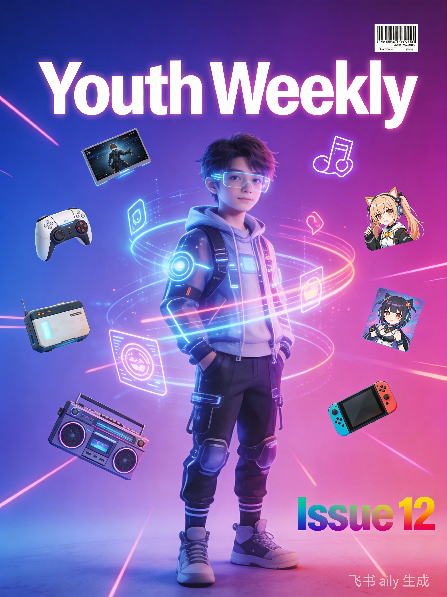
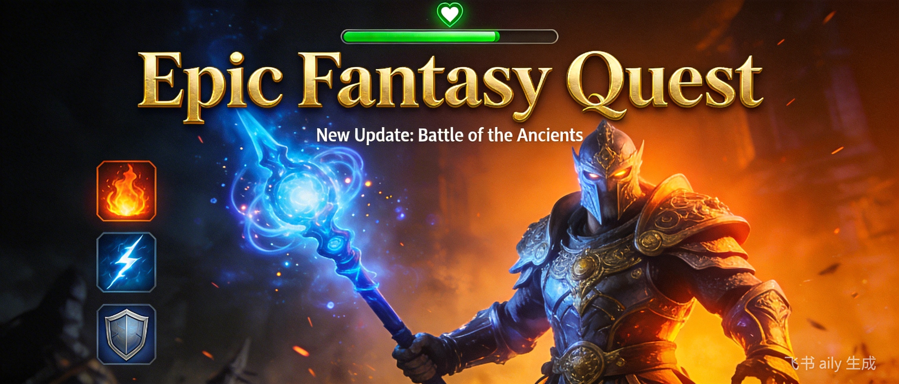
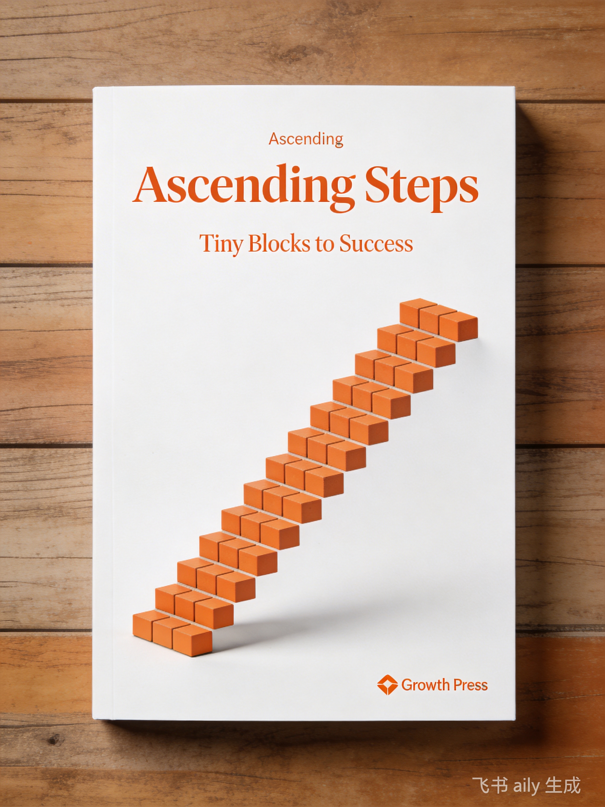

<div align="center">



# 🌟 青年周刊 · Youth Weekly

**为年轻人打造的开源内容聚合周刊**

*融合「青年文摘 + 看天下 + 知音漫客 + 大众游戏报」的特色平台*

[](https://github.com/xfengyin/youth-weekly/actions)
[](./LICENSE)
[](https://xfengyin.github.io/youth-weekly/rss.xml)
[](https://github.com/xfengyin/youth-weekly/issues)
[](https://github.com/xfengyin/youth-weekly)

[🌐 在线访问](https://xfengyin.github.io/youth-weekly/) ·
[📮 订阅 RSS](https://xfengyin.github.io/youth-weekly/rss.xml) ·
[📮 邮件订阅](https://xfengyin.github.io/youth-weekly/subscribe/) ·
[💬 参与讨论](https://github.com/xfengyin/youth-weekly/issues)

</div>

---

## 📰 最新一期 · 第 6 期

> **2026年5月11日** | 时间过得真快！转眼已经到了第6期《青年周刊》。

<table>
<tr>
<td width="50%" align="center">

<br/><sub>🎵 Suno AI 3.0 — 音乐创作革命</sub>
</td>
<td width="50%" align="center">

<br/><sub>🎮《黑神话：悟空》最终前瞻</sub>
</td>
</tr>
</table>

**本期亮点：**

| 板块 | 亮点内容 | 简介 |
|:----:|---------|------|
| 🚀 科技 | Suno AI 3.0 音乐创作革命 | 声音克隆与长音频生成 |
| 📡 科技 | 5G-A 商用加速 | 万兆时代到来 |
| 🎓 故事 | 毕业季特别策划 | 职场生存指南与面试技巧 |
| 🎮 游戏 | 《黑神话：悟空》最终前瞻 | 离发售还有3个月 |

👉 **[阅读第6期全文](https://xfengyin.github.io/youth-weekly/issues/006/)** · [浏览所有周刊](https://xfengyin.github.io/youth-weekly/issues/)

---

## 🎯 九大内容板块

我们用九大板块覆盖年轻人的精神世界——从前沿科技到二次元文化，从游戏攻略到职场成长。

### 🚀 科技新势力


AI 工具、编程技巧、效率软件、前沿技术。追踪改变世界的新力量。

**往期精选：** Suno AI 3.0 · 5G-A 商用 · Cursor AI · Warp 终端

---

### 🎨 二次元次元壁


ACG 资讯、动漫评论、原创插画、漫展动态。打破次元壁，连接热爱。

**往期精选：** 葬送的芙莉莲 S2 · 赛博朋克艺术 · 漫展前线

---

### 🎮 游戏研究所



游戏评测、攻略心得、行业动态、独立游戏。为热爱游戏的人而生。

**往期精选：** 黑神话：悟空前瞻 · 绝区零 · 沙丘2

---

### 📖 青春故事会



成长故事、职场经验、学习心得、读者投稿。记录青春的每一种可能。

**往期精选：** 原子习惯 · 毕业季职场指南 · 学习方法论

---

### 🛠️ 好工具


生产力工具、开发利器、生活助手推荐。让好工具成为你的超能力。

**往期精选：** Cursor AI 编辑器 · Warp 终端 · 效率工具合集

---

### 👀 在看什么


影视、书籍、播客推荐及深度评论。你需要的下一部好作品在这里。

**往期精选：** 沙丘2 · 葬送的芙莉莲 · 年度播客推荐

---

### 📷 一周图鉴


视觉内容精选，用图片记录精彩瞬间。一张图胜过千言万语。

**往期精选：** 城市夜景 · AI 生成艺术 · 读者摄影投稿

---

### 💼 谁在招人


招聘信息、实习机会、职场动态。连接年轻人才与优质机会。

**往期精选：** 毕业季招聘 · 互联网实习 · 职场趋势

---

### 📬 编读往来

读者反馈、话题讨论、下期预告。你的声音，我们都在听。

**参与方式：** [GitHub 讨论](https://github.com/xfengyin/youth-weekly/issues) · 邮件投稿

---

## ✨ 为什么读青年周刊

<table>
<tr>
<td align="center" width="25%">
<h3>🎯 内容精选</h3>
<p>每周从海量信息中精选优质内容，拒绝信息焦虑，只看有价值的。</p>
</td>
<td align="center" width="25%">
<h3>🌈 领域多元</h3>
<p>九大板块覆盖科技、游戏、二次元、职场，一个周刊满足你的全部兴趣。</p>
</td>
<td align="center" width="25%">
<h3>🤝 开源共建</h3>
<p>参考阮一峰《科技爱好者周刊》模式，所有人都可以投稿和参与编辑。</p>
</td>
<td align="center" width="25%">
<h3>📦 多端阅读</h3>
<p>网站、RSS、邮件订阅、微信小程序，随时随地用你喜欢的方式阅读。</p>
</td>
</tr>
</table>

---

## 📮 订阅方式

### RSS 订阅

```xml
https://xfengyin.github.io/youth-weekly/rss.xml
```

推荐阅读器：[Feedly](https://feedly.com) · [Inoreader](https://www.inoreader.com) · [Reeder](https://reederapp.com/)

### 邮件订阅

每周一直接送达邮箱，不错过任何一期。

👉 **[立即订阅](https://xfengyin.github.io/youth-weekly/subscribe/)**

---

## ✍️ 投稿

我们欢迎各种类型的原创内容投稿！

| 投稿方式 | 说明 | 链接 |
|---------|------|------|
| GitHub Issue | 使用投稿模板提交 | [内容投稿](https://github.com/xfengyin/youth-weekly/issues/new?template=content_submission.md) |
| Pull Request | Fork 后在 `docs/issues/` 提交 Markdown | [贡献指南](./CONTRIBUTING.md) |
| 邮件 | 发送至编辑部邮箱 | youth-weekly@xfengyin.com |

**内容要求：** 原创或已获授权 · Markdown 格式 · 500-3000 字 · 配图注明来源

---

## 🛠️ 技术架构

<details>
<summary>📖 展开查看技术栈详情</summary>

| 层级 | 技术 | 说明 |
|------|------|------|
| 前端框架 | Next.js 14 + React 18 | SSG 静态导出 |
| 类型系统 | TypeScript 5 | 全量类型覆盖 |
| 样式方案 | Tailwind CSS | 原子化 CSS |
| 内容处理 | gray-matter + remark | Markdown 解析 |
| 全文搜索 | Fuse.js | 客户端模糊搜索 |
| 图标库 | Lucide React | 轻量图标方案 |
| 后端脚本 | Python 3.12 + uv | 内容采集与生成 |
| 插件架构 | SPI 模式 | 可扩展的插件系统 |
| CI/CD | GitHub Actions | 自动构建部署 |
| 部署 | GitHub Pages | 静态托管 |

</details>

<details>
<summary>📁 展开查看项目结构</summary>

```
youth-weekly/
├── 📁 docs/                     # 周刊内容
│   ├── issues/001/              # 第 1 期
│   │   ├── README.md            # 周刊正文
│   │   └── assets/              # 图片资源
│   └── issues/006/              # 第 6 期（最新）
│
├── 📁 web/                      # Next.js 前端
│   ├── src/app/                 # 页面与组件
│   │   ├── page.tsx             # 首页
│   │   ├── issues/              # 周刊列表与详情
│   │   ├── search/              # 全文搜索
│   │   └── subscribe/           # 订阅页面
│   └── package.json
│
├── 📁 scripts/                 # Python 自动化
│   ├── src/youth_weekly/        # 核心模块
│   │   ├── core/                # 配置与采集
│   │   ├── plugins/             # 插件（RSS等）
│   │   └── cli.py               # CLI 入口
│   └── pyproject.toml
│
├── 📁 .github/workflows/        # CI/CD
│   ├── ci.yml                   # 持续集成
│   ├── deploy.yml               # 自动部署
│   └── weekly-publish.yml       # 定时发布
│
└── README.md                   # 你正在看的这个文件
```

</details>

<details>
<summary>🚀 展开查看本地开发指南</summary>

### 环境要求

- **Node.js** 18+（推荐 20+）
- **Python** 3.12+
- **uv**（Python 包管理器）

### 快速开始

```bash
# 克隆仓库
git clone https://github.com/xfengyin/youth-weekly.git
cd youth-weekly

# 启动前端
cd web
npm install
npm run dev          # 访问 http://localhost:3000

# 运行自动化脚本（可选）
cd ../scripts
uv sync
uv run youth-weekly collect    # 采集内容
uv run youth-weekly generate   # 生成周刊
uv run youth-weekly rss        # 生成 RSS
```

### 本地质量门禁（pre-commit）

为避免不合格代码进入 CI 流水线，推荐在本地启用 pre-commit 钩子：

```bash
# 1. 同步依赖（含 dev 工具链）
cd scripts && uv sync --extra dev && cd ..

# 2. 安装 Git 钩子（仅需执行一次）
uv run pre-commit install

# 3. 一键跑全量检查（format + lint + test）
make all

# 4. 单独跑某项
make format        # 仅格式化
make lint          # 仅静态检查
make test          # 仅跑测试
make audit         # 仅安全扫描
make typecheck     # mypy 类型检查（速度较慢，按需执行）
```

可用的 make 目标清单：

| 目标 | 作用 |
|------|------|
| `make install`      | 安装 Python 依赖（uv sync） |
| `make install-hooks`| 安装 pre-commit Git 钩子 |
| `make format`       | black + isort 格式化 |
| `make lint`         | flake8 + isort/black check |
| `make test`         | pytest 跑测试 + 覆盖率 |
| `make audit`        | bandit 安全扫描 |
| `make all`          | format + lint + test |
| `make ci`           | 模拟完整 CI 流水线 |
| `make pre-commit`   | 手动跑 pre-commit 全量检查 |

> 提示：若不便安装 pre-commit 框架，也可使用 `bash scripts/pre-commit.sh` 作为零依赖的轻量替代。

</details>

---

## 🗓️ 发布节奏

| 时间 | 事件 | 说明 |
|------|------|------|
| 每周一 08:00 | 自动部署 | GitHub Actions 触发构建 |
| 每周一 21:00 | 发布检查 | 检测新内容并发布 |
| 随时 | 手动触发 | 通过 GitHub Actions 手动部署 |

---

## 🤝 参与贡献

我们欢迎各种形式的贡献：

| 贡献类型 | 方式 |
|---------|------|
| 🐛 报告 Bug | [提交 Issue](https://github.com/xfengyin/youth-weekly/issues/new?template=bug_report.md) |
| 💡 功能建议 | [提交建议](https://github.com/xfengyin/youth-weekly/issues/new?template=feature_request.md) |
| 📝 内容投稿 | [投稿模板](https://github.com/xfengyin/youth-weekly/issues/new?template=content_submission.md) |
| 🔧 代码改进 | [Pull Request](./.github/pull_request_template.md) |

详见 [CONTRIBUTING.md](./CONTRIBUTING.md)。

---

## 📄 许可证

- **代码** — [MIT License](./LICENSE)
- **内容** — [CC BY-NC-SA 4.0](https://creativecommons.org/licenses/by-nc-sa/4.0/)

---

## 🙏 致谢

- 灵感来源于 [阮一峰的科技爱好者周刊](https://github.com/ruanyf/weekly)
- 前端框架由 [Next.js](https://nextjs.org/) 强力驱动
- 感谢所有贡献者和读者的支持

---

<div align="center">

## ⭐ Star History

如果这个项目对你有帮助，欢迎点个 Star！

[](https://star-history.com/#xfengyin/youth-weekly&Date)

---

**用 ❤️ 为年轻人创作**

[🌐 访问网站](https://xfengyin.github.io/youth-weekly/) ·
[📦 GitHub](https://github.com/xfengyin/youth-weekly) ·
[📮 RSS 订阅](https://xfengyin.github.io/youth-weekly/rss.xml) ·
[📮 邮件订阅](https://xfengyin.github.io/youth-weekly/subscribe/)

</div>
